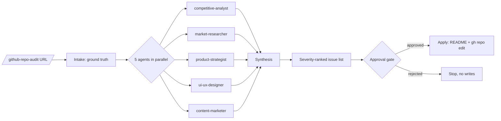

# github-repo-audit

[](https://opensource.org/licenses/MIT) [](https://docs.anthropic.com/en/docs/claude-code) [](https://github.com/dancolta/github-repo-audit)

**Audits your GitHub repo's public surface across 5 dimensions, in parallel.**

*For solo OSS maintainers whose working product is buried under a weak README.*

> **What this isn't:** a code linter, a security scanner, or a generic LLM "rewrite my README" prompt. It looks at how your repo is *perceived* — by humans skimming GitHub, by Google, and by AI engines summarizing your project. Nothing else.

<!-- HERO: terminal cast pending render via /claude-gif. Until then, the Mermaid fan-out below is the visual anchor. -->
<!--  -->

Your README should feel like [ripgrep](https://github.com/BurntSushi/ripgrep)'s or [bat](https://github.com/sharkdp/bat)'s — opinionated, scannable, and confident about what it is and isn't. Not like a SaaS landing page.

## How it works



1. **Intake** — you paste a repo URL (or point at a local path) and a one-paragraph "what this product actually is." If you skip that paragraph, the skill drafts one from your README and asks you to confirm.
2. **Five agents in parallel** — each looks at one dimension of your repo's public surface and returns under 800 words.
3. **You approve, the skill applies** — synthesis becomes a severity-ranked issue list (Critical/High/Medium/Low). You pick what to apply. Nothing writes to disk or hits `gh repo edit` without your sign-off.

## Install

```bash
mkdir -p ~/.claude/skills && \
  git clone https://github.com/dancolta/github-repo-audit ~/.claude/skills/github-repo-audit
```

That's it. The skill is now available as `/github-repo-audit` (and triggers on phrases like "audit my repo" or "rewrite my readme").

## Usage

```
/github-repo-audit https://github.com/yourname/yourproject
```

Then answer the ground-truth question, watch the 5 agents run in parallel, review the issue list, and approve the fixes you want applied.

## What it audits

The 5 dimensions:

1. **Competitive landscape** — patterns from 5–10 high-star OSS READMEs in your category
2. **Target-user pain language** — verbatim vocabulary from Reddit, HN, X, dev forums
3. **Product positioning** — anti-positioning lines, comparison-table axes, one-sentence pitch
4. **README visual hierarchy + asset hygiene** — above-fold blueprint, hero asset presence and dimensions, badge discipline (max 3), TOC and accordion patterns. Visual *design* judgment still requires human review.
5. **SEO + AI-citation surface** — GitHub topic tags, Google keyword map, Perplexity/ChatGPT/Claude citation blocks

## What it produces

- `synthesis.md` — combined findings from all 5 agents
- `issues.md` — Critical/High/Medium/Low issues with proposed fixes
- `README.md` — rewritten in a fixed section order
- `github-metadata.md` — About sentence + topic tags + suggested rename
- `hero-shotlist.md` — frame-by-frame spec for the hero asset

## Companion skill

[`claude-gif`](https://github.com/dancolta/claude-gif) — optional. If installed, the audit offers to render the hero asset shotlist into an actual GIF. The audit works end-to-end without it; you just get the spec instead of the file.

## How it compares

|  | github-repo-audit | ChatGPT prompt | README generator | Manual rewrite |
|---|:---:|:---:|:---:|:---:|
| Audits full public surface (name, About, topics, hero, README) | ✓ | ✗ | ✗ | partial |
| Multi-agent: competitive + market + product + UI/UX + SEO | ✓ | ✗ | ✗ | ✗ |
| Severity-ranked issue list before any edit | ✓ | ✗ | ✗ | ✗ |
| Approval gate before applying fixes | ✓ | ✗ | n/a | n/a |
| Hard rejection of AI-slop phrasing (emoji headers, "unleash", filler) | ✓ | ✗ | ✗ | partial |
| Applies fixes via `gh repo edit` (topics, About, name) | ✓ | ✗ | ✗ | partial |
| Preserves maintainer voice | ✓ | ✗ | partial | ✓ |
| Time to actionable diff | ~5 min | ~30 min of prompting | hours of templating | days–weeks |

## FAQ

<details>
<summary><b>Does this skill work on private repos?</b></summary>

Yes. The audit reads the local repo and works offline for the README. The `gh repo edit` step needs `gh auth status` to pass; if you're unauthenticated, the skill emits a copy-paste block of the commands instead of running them.
</details>

<details>
<summary><b>What if the 5 agents disagree?</b></summary>

The orchestrator surfaces a conflict to you only when it's load-bearing — contradictory positioning sentences, category decisions, or rename recommendations. Stylistic differences get merged automatically. You're not asked to arbitrate every micro-disagreement.
</details>

<details>
<summary><b>Will it overwrite my README without warning?</b></summary>

No. Every file write and every `gh` mutation requires your explicit approval. The 5 research agents run read-only.
</details>

<details>
<summary><b>Does it work on monorepos?</b></summary>

It audits the root README. Sub-package READMEs (`packages/*/README.md`) are out of scope — re-run the skill from inside the package directory if you need those audited.
</details>

<details>
<summary><b>How is this different from a README generator?</b></summary>

A README generator creates documentation from scratch. github-repo-audit analyzes an existing README and repo surface to find specific positioning, clarity, and discoverability gaps — targeting maintainers who already have a working product but an underselling public presence.
</details>

<details>
<summary><b>What is a Claude Code skill?</b></summary>

A Claude Code skill is a reusable command file (a Markdown file with embedded instructions) that extends Claude Code's behavior for a specific workflow. github-repo-audit is a skill that acts as an orchestrator, spawning specialist sub-agents to audit a repo's public surface and apply approved improvements.
</details>

## License

MIT — see [LICENSE](LICENSE).

## Credits

Built by [Dan Colta](https://github.com/dancolta) as a Claude Code skill. Bug reports: [issues](https://github.com/dancolta/github-repo-audit/issues).
</content>
